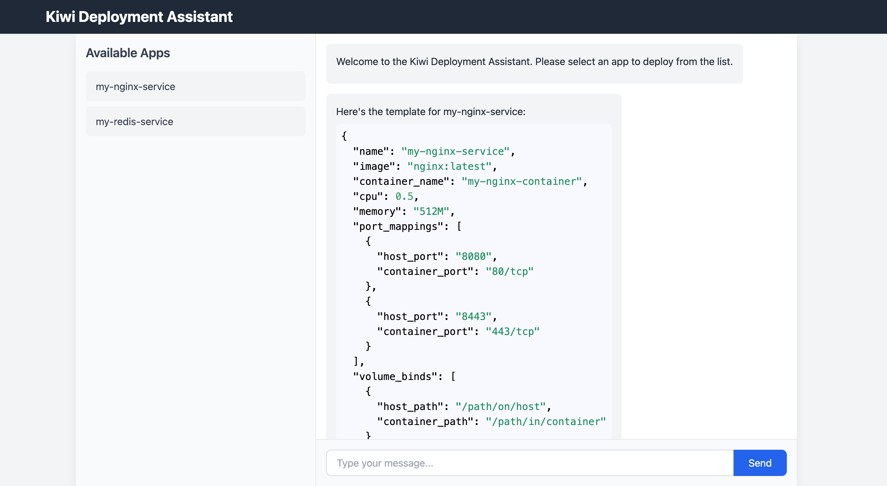

# Kiwi

`Kiwi` is a `Platform as a Service` that help you to build and deploy your services easily.

## Usage 

### Start frontend

```shell
cd frontend

npm install

npm start
```

### start backend

```env
export OPENAI_API_ENDPOINT=xxxx
export OPENAI_API_KEY=xxx
```

```shell
go run main.go
```

### Chat!!

1. click left sidebar to select a type service


2. input your request


3. check generated configuration


4. deploy!
click deploy button to deploy it.

5. test your service